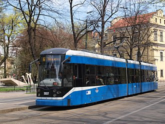
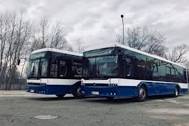
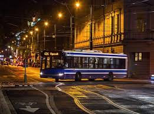

# Krakow Public Transport

## TEAM
1. Mahir Şahin – GitHub: [MahirSahin8](https://github.com/MahirSahin8) – 
Tasks: 1, 6  
2. AYKUT AKANLI – GitHub: [aykut981]([https://github.com/aykut981) – Tasks: 2, 3  
3. Charaf Toumi – GitHub: 
[charaf_username](https://github.com/charaf_username) – Tasks: 4, 5  

---

## INTRODUCTION
Krakow has one of the most developed public transport systems in Poland.  
It combines trams and buses operated by ZTP Krakow, allowing passengers to 
travel efficiently around the city.  
Tickets can be purchased via vending machines, mobile apps, or directly from 
drivers.  

The tram network is known for being punctual and environmentally friendly, 
as many lines run on renewable electricity.  
Buses complement the trams by connecting outer districts and nearby suburbs.  
The system supports both day and night services, ensuring reliable movement 
at all hours.  

Overall, Krakow's transport system is affordable, modern, and crucial for 
students, tourists, and workers.

---

## DATA
Example data used in this project:  

| line | type | length_km | stops |
|------|------|------------|-------|
| 1 | tram | 10 | 15 |
| 2 | bus | 8 | 12 |
| 3 | tram | 6 | 10 |

---

## IMAGES

**Tram**

**Bus**

**Local image**

